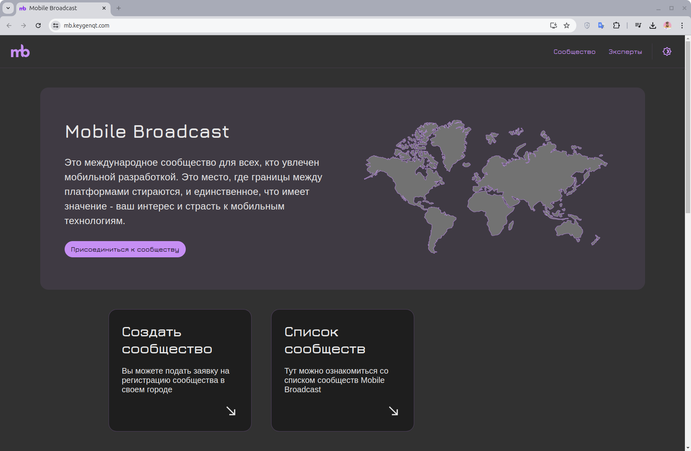

# KMP Mobile Broadcast

### Subscribe and like! 

> MVP Done 🎉

I set myself a task: to implement a template for future similar projects and do a good deed for [Mobile Broadcast](https://mobilebroadcast.dev). Since this is partly a "template", the project is characterized by reduced coupling of components. There are a lot of different components and features, in the project I collected many of my developments and improved those that were already there. The site turned out to be quite large: 11k lines of JavaScript and 9k lines of Kotlin. It is not perfect, there is still work to do, but this is the path of development.



### Includes

- Website / [React](https://react.dev/).
- Admin Panel / [React](https://react.dev/).
- API / [Ktor](https://ktor.io/).
- Shared module / [KMP](https://kotlinlang.org/docs/multiplatform.html).
- Docker / [Compose](https://docs.docker.com/compose/).

### Links

- DB - https://mb-db.keygenqt.com
- API - https://mb-api.keygenqt.com
- Website - https://mb.keygenqt.com
- Admin-Panel - https://mb-admin.keygenqt.com

### License

```
Copyright 2024 Vitaliy Zarubin

Licensed under the Apache License, Version 2.0 (the "License");
you may not use this file except in compliance with the License.
You may obtain a copy of the License at

    http://www.apache.org/licenses/LICENSE-2.0

Unless required by applicable law or agreed to in writing, software
distributed under the License is distributed on an "AS IS" BASIS,
WITHOUT WARRANTIES OR CONDITIONS OF ANY KIND, either express or implied.
See the License for the specific language governing permissions and
limitations under the License.
```
